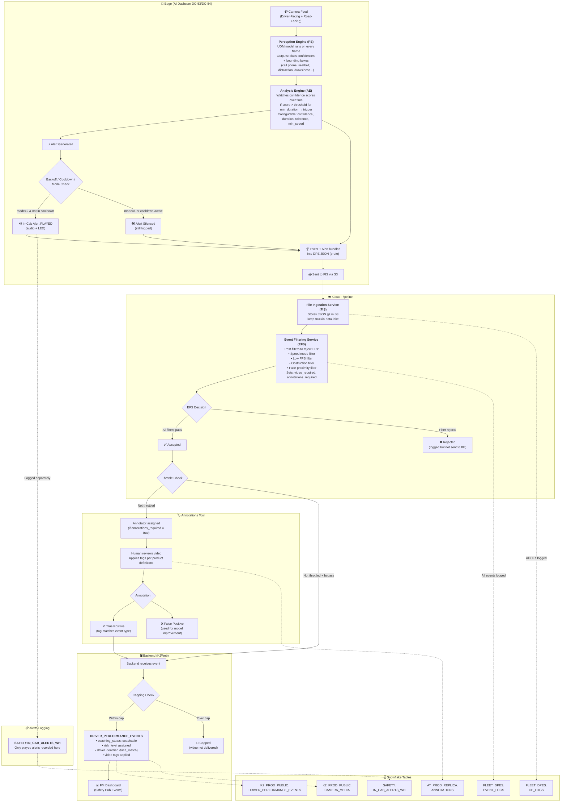

# Safety AI Event Pipeline — Edge to FM Dashboard

## Overview

The Safety AI pipeline traces an event from camera detection through to the fleet manager's dashboard. Every stage has corresponding Snowflake tables for querying.

## Pipeline Diagram

## Stage-by-Stage Breakdown

### 1. Edge (Camera)

| Component | What it does |
|---|---|
| **Perception Engine (PE)** | UDM model runs inference on every frame. Outputs class confidence scores (cell phone, seatbelt, distraction, etc.) and bounding boxes (face, phone, person). |
| **Analysis Engine (AE)** | State machine that watches PE outputs over time. If confidence > threshold for min_duration (typically 3–5s), generates an event and/or alert. Configurable per behavior via hubble configs. |
| **In-Cab Alert** | Audio/LED alert played immediately on-edge. Rate-limited by backoff and cooldown (also on-edge). `mode=1` = permanently silenced, `mode=2` = normal. Silenced alerts are still logged. |
| **DPE JSON** | All events in close proximity bundled into a composite event (CE) proto file, sent to FIS. Contains PE outputs, AE data, IMU/GPS, configs, and camera/vehicle metadata. |

### 2. Cloud — File Ingestion Service (FIS)

Receives DPE JSON from edge, stores as `.json.gz` in S3 (`keep-truckin-data-lake`), passes to EFS.

### 3. Cloud — Event Filtering Service (EFS)

Server-side post-filters to reject false positives. Filters include:
- **Speed mode** — event validity based on vehicle speed
- **Low FPS** — reject if camera frame rate was too low
- **Obstruction** — reject if camera was obstructed
- **Face proximity** — reject if face wasn't close enough to camera

EFS sets `video_required` and `annotations_required` flags. **Alerts are NOT processed by EFS — only logged.**

Outcomes:
- **Accepted** → forwarded to annotations and/or backend
- **Rejected** → logged in EVENT_LOGS but not sent further
- **Throttled** → accepted by EFS but not sent to backend (present in EVENT_LOGS but absent from DRIVER_PERFORMANCE_EVENTS)

### 4. Annotations Tool

Human annotators review video, apply behavioral tags per product definitions. Results:
- **True Positive** → pushed to backend for FM dashboard
- **False Positive** → used for model retraining, not shown to fleet manager

### 5. Backend (K2Web)

Receives validated events. Applies capping (limits events sent to FM dashboard per driver/period). Records in `DRIVER_PERFORMANCE_EVENTS` with:
- Coaching status, risk level, video tags
- Driver identification (face_match or driving_period)
- Location, speed, heading data

**Capped** events have no video — `additional_data` will say "capped."

### 6. In-Cab Alerts Table

`SAFETY.PRODUCTION_JSON_SAFETY_IN_CAB_ALERTS_WH` — **only contains alerts that were actually played** (audio heard in-cab). This is the definitive source for "did the driver hear an alert?" Cannot be directly mapped to DPE by ID — use `created_at` timestamps to correlate.

## Snowflake Table Map

| Table | What's in it | Key fields |
|---|---|---|
| `FLEET_DPES.PRODUCTION_JSON_FLEET_DPE_EVENT_LOGS` | All events from edge (accepted + rejected) | offline_id, event_type, status, filter_results, extra_attributes |
| `FLEET_DPES.PRODUCTION_JSON_FLEET_DPE_CE_LOGS` | Composite event info + S3 file_key for JSON | ce_offline_id, identifier, file_key, cam_model_name |
| `AT_PROD_REPLICA_AT_V0.ANNOTATIONS` | Annotation results | offline_id, tags, status, consensus |
| `K2_PROD_PUBLIC.DRIVER_PERFORMANCE_EVENTS` | Events on FM dashboard | offline_id, type, risk_level, coaching_status, driver_id |
| `K2_PROD_PUBLIC.CAMERA_MEDIA` | Video metadata | offline_id |
| `SAFETY.PRODUCTION_JSON_SAFETY_IN_CAB_ALERTS_WH` | Played in-cab alerts only | created_at, alert_type |
| `K2_PROD_PUBLIC.HUBBLE_CONFIGS` | Camera config versions | eld_device_id, version, config (JSON) |
| `K2_PROD_PUBLIC.ELD_DEVICES` | ELD/VG device info | identifier, company_id |
| `K2_PROD_PUBLIC.ELD_DEVICE_SHADOWS` | VG5 model versions + configs | — |

## Key Gotcha

The `ALERT_STATUS` field in EFS event logs does NOT confirm the alert was played. It only means an alert was **associated** with the event. Alerts can be silenced by backoff, cooldown, or mode=1 — and still appear in ALERT_STATUS. The only definitive proof is the `SAFETY.IN_CAB_ALERTS_WH` table.
