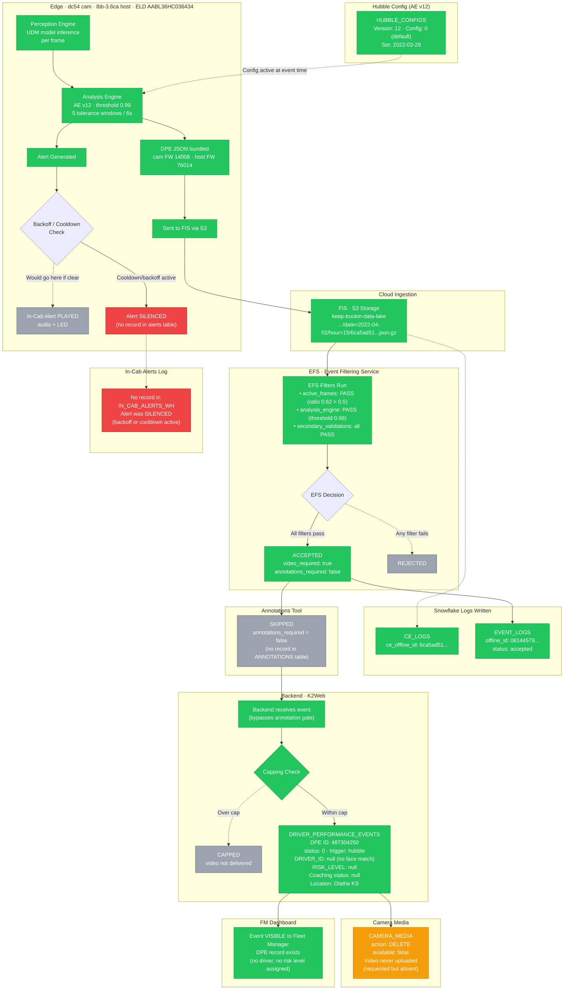

# Cell Phone Event — End-to-End Pipeline Trace

**Offline ID:** `06144579-a7d9-4669-92eb-7d290cae1f55`
**CE Offline ID:** `6ca5ad51-6a3b-4024-876f-ed1d0f7d2a43`
**Event Date:** 2022-04-02T15:44:32 UTC (08:44 PT)
**Duration:** ~6 seconds (5 tolerance windows)
**Location:** Olathe, KS
**Speed:** 66 → 56 kph

---

## Pipeline Diagram

> **Color key:** Green = traversed · Red = blocked/failed · Yellow = degraded/partial · Gray = not applicable (skipped by design)



---

## Stage-by-Stage Findings

### 1. Edge (DC-54 Camera)

| Field | Value |
|---|---|
| Camera Model | dc54 |
| Camera Serial | ABAD41DB462148 |
| Camera FW | 14008 |
| Host Model | lbb-3.6ca |
| Host FW | 76014 |
| AE Version | 12 |
| AE Threshold | 0.99 |
| Tolerance Windows | 5 (over 6 seconds) |
| Hubble Config | v12 · `"0"` (default, set 2022-03-29) |

### 2. FIS — File Ingestion Service ✅

S3 path confirmed in both CE_LOGS and CAMERA_MEDIA:
```
s3://keep-truckin-data-lake/production/core/fis/type=driver_performance_message/date=2022-04-02/hour=15/6ca5ad51-6a3b-4024-876f-ed1d0f7d2a43.json.gz
```

### 3. EFS — Event Filtering Service ✅ Accepted

| Filter | Result | Detail |
|---|---|---|
| active_frames | PASS | ratio 0.62 > threshold 0.5 |
| analysis_engine | PASS | threshold 0.99 |
| secondary_validations (0.5/0.75/0.8/0.9/0.99) | PASS | all true |
| **Overall** | **accepted** | video_required: true · annotations_required: false |

### 4. Annotations — SKIPPED (gray)

`annotations_required = false` → no annotation record created. Event forwarded directly to backend.

### 5. Backend DPE ✅ (not capped)

| Field | Value |
|---|---|
| DPE ID | 487304250 |
| Status | 0 |
| Trigger | hubble |
| Filter Version | v4 |
| DRIVER_ID | **null** — no face match or driving period match |
| RISK_LEVEL | **null** — not assigned |
| Coaching Status | **null** |
| Additional Data | null → **NOT capped** |
| Location | Olathe, KS (38.856°N, -94.817°W) |
| Speed | 66 kph → 56 kph |

### 6. Camera Media ⚠️ Deleted

| Field | Value |
|---|---|
| Action | **delete** |
| Available | **false** |
| File uploaded | No (FILE_SIZE, FILE_TYPE all null) |

Video was requested (`video_required: true`) but media record was immediately marked `delete` — video likely never left the device (possibly device went offline).

### 7. In-Cab Alert ❌ Not Played

No record found in `SAFETY.PRODUCTION_JSON_SAFETY_IN_CAB_ALERTS_WH` for this device in the ±2 min window. Alert was **silenced** — either backoff cooldown was active or another event in the same CE bundle already triggered the cooldown.

Note: `ALERT_STATUS` in EVENT_LOGS shows `associated_events: [f7895d72...]` — an associated event exists but that is a different `offline_id`, suggesting the alert may have fired on a sibling event in the same composite event bundle.

### 8. FM Dashboard ✅ Visible

DPE record `487304250` exists in `DRIVER_PERFORMANCE_EVENTS` and is visible to the fleet manager — but with no driver, no risk level, and no video.

---

## Notable Observations

1. **No driver identified** — `DRIVER_ID` is null. No face match succeeded and no driving period was associated. Event appears on dashboard but is unattributed.
2. **No risk level or coaching status** — likely because no driver assignment means no coaching workflow triggered.
3. **Video missing** — `CAMERA_MEDIA.action = 'delete'` and `available = false`. Device may have been offline or video upload failed.
4. **Alert silenced** — the in-cab alert did not play for this specific event. A sibling event in the same CE bundle (`f7895d72`) was the primary alert carrier.
5. **Hubble config `"0"`** — default config with no customization. Threshold (0.99) came from base AE defaults.

---

## Queries Used

```sql
-- Step 1: Find event
SELECT event_logs.OFFLINE_ID, event_logs.CE_OFFLINE_ID, event_logs.STATUS,
       event_logs.CREATED_AT, ce_logs.IDENTIFIER, ce_logs.AE_VERSION, ce_logs.CAM_MODEL_NAME
FROM DB_WH.FLEET_DPES.PRODUCTION_JSON_FLEET_DPE_EVENT_LOGS event_logs
JOIN DB_WH.FLEET_DPES.PRODUCTION_JSON_FLEET_DPE_CE_LOGS ce_logs
    ON ce_logs.CE_OFFLINE_ID = event_logs.CE_OFFLINE_ID
WHERE event_logs.EVENT_TYPE = 'cell_phone'
  AND event_logs.STATUS = 'accepted'
  AND event_logs.CREATED_AT <= DATEADD('day', -7, CURRENT_TIMESTAMP())
LIMIT 1

-- Step 2: EFS Event Log
SELECT * FROM DB_WH.FLEET_DPES.PRODUCTION_JSON_FLEET_DPE_EVENT_LOGS
WHERE OFFLINE_ID = '06144579-a7d9-4669-92eb-7d290cae1f55'

-- Step 3: CE Log
SELECT * FROM DB_WH.FLEET_DPES.PRODUCTION_JSON_FLEET_DPE_CE_LOGS
WHERE CE_OFFLINE_ID = '6ca5ad51-6a3b-4024-876f-ed1d0f7d2a43'

-- Step 4: Hubble Config
SELECT eld.identifier, hc.version, hc.config, hc.created_at
FROM DB_WH.K2_PROD_PUBLIC.ELD_DEVICES eld
JOIN DB_WH.K2_PROD_PUBLIC.HUBBLE_CONFIGS hc ON hc.eld_device_id = eld.id
WHERE eld.identifier = 'AABL36HC036434' AND hc.version = 12

-- Step 5: Annotations
SELECT * FROM DB_WH.AT_PROD_REPLICA_AT_V0.ANNOTATIONS
WHERE OFFLINE_ID = '06144579-a7d9-4669-92eb-7d290cae1f55'

-- Step 6: Backend DPE
SELECT * FROM DB_WH.K2_PROD_PUBLIC.DRIVER_PERFORMANCE_EVENTS
WHERE OFFLINE_ID = '06144579-a7d9-4669-92eb-7d290cae1f55'

-- Step 7: Camera Media
SELECT * FROM DB_WH.K2_PROD_PUBLIC.CAMERA_MEDIA
WHERE OFFLINE_ID = '06144579-a7d9-4669-92eb-7d290cae1f55'

-- Step 8: In-Cab Alerts (use HOST_SERIAL_NUMBER + timestamp window)
SELECT * FROM DB_WH.SAFETY.PRODUCTION_JSON_SAFETY_IN_CAB_ALERTS_WH
WHERE HOST_SERIAL_NUMBER = 'AABL36HC036434'
  AND CREATED_AT BETWEEN '2022-04-02T08:43:00' AND '2022-04-02T08:47:00'
```
