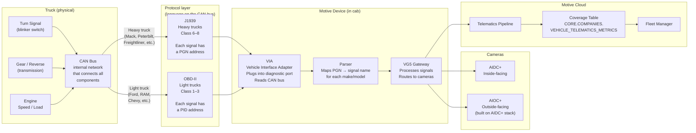
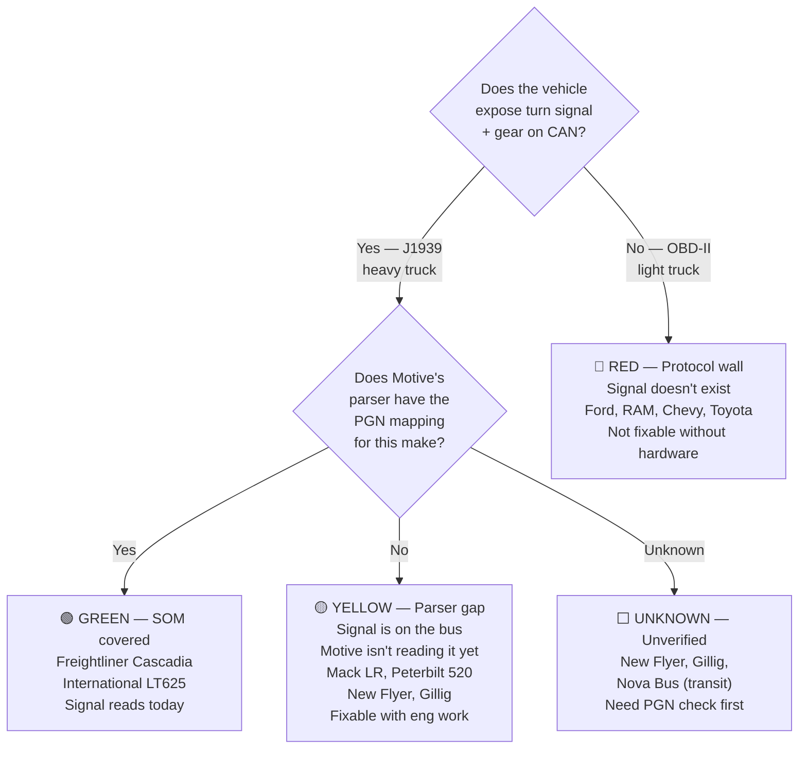

# AIOC+ Signal Architecture — How It Works

**Last updated:** 2026-04-22

---

## How a vehicle signal becomes an AIOC+ alert

---

## Where the gaps are

---

## What each tier means for AIOC+

| Tier | Signal status | AIOC+ works? | Fix |
|---|---|---|---|
| 🟢 Green | >90% coverage | Yes — V1 ready | None needed |
| 🟡 Yellow | J1939 parser gap | No — signal on bus, not read | Add PGN mapping for that make |
| 🔴 Red | OBD-II, no PID | No — signal doesn't exist | Hardware change (out of V1 scope) |
| ⬜ Unknown | Not verified | Unknown | Ask telematics team: does this make's PGN parse? |

---

## The specific gaps blocking V1 beta

### Waste accounts (backing use case)

| Make | Used by | Gap type | Fix |
|---|---|---|---|
| Mack LR | Ace Disposal, Noble, AAA Carting, WC portion | 🟡 Parser gap | Add Mack LR PGN mappings for turn + gear |
| Peterbilt 520 | Gilton, GreenWaste, WC portion | 🟡 Parser gap | Add Peterbilt 520 PGN mappings |

### Transit accounts (right-turn use case)

| Make | Used by | Gap type | Fix |
|---|---|---|---|
| New Flyer | RATP DEV USA, CapMetro | ⬜ Unknown | Confirm PGN coverage with Gautam/Hareesh first |
| Gillig | RATP DEV USA | ⬜ Unknown | Same |
| IC Bus / Thomas Built | NYC School Bus | 🟢 Probably green | International + Freightliner chassis — likely covered |

---

## How to fix a parser gap

A parser gap is a mapping problem, not a hardware problem. The signal exists on the vehicle's CAN bus. Motive's parser just doesn't know which PGN address to look at for that specific make/model.

**Fix steps:**
1. Get the J1939 PGN spec for the make (from OEM or reverse-engineering the CAN bus)
2. Add the PGN → signal name mapping to Motive's parser
3. Deploy parser update to devices on that make
4. Signal starts flowing — coverage numbers improve in `VEHICLE_TELEMATICS_METRICS`

**Owner:** Telematics / Connected Devices team (Pat Miller, Gautam/Hareesh for edge platform)

**Timeline:** Historically 14–55 days per make depending on complexity. Proactive coverage engine (Platform v2 track) is designed to bring this down.
